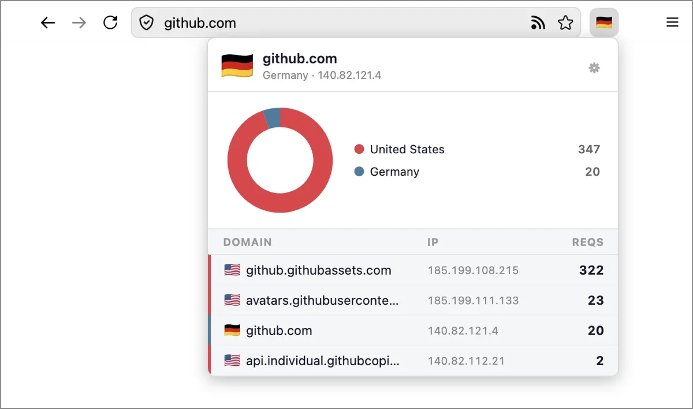

# Geo Flags

A Firefox extension that shows a little flag icon and a breakdown of locations for every domain a webpage contacts.

## Credits

* Flag icons: https://flagpedia.net/
* GeoIP database: https://www.iplocate.io/free-databases
